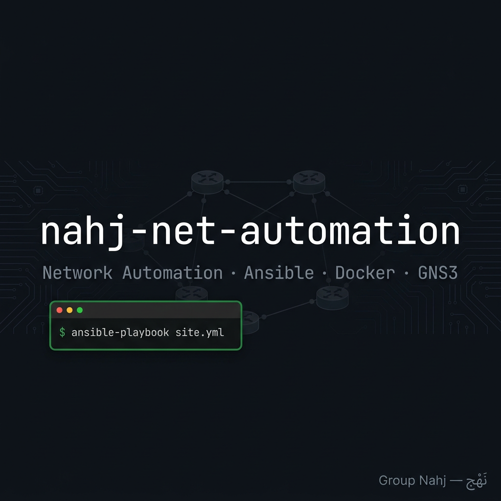
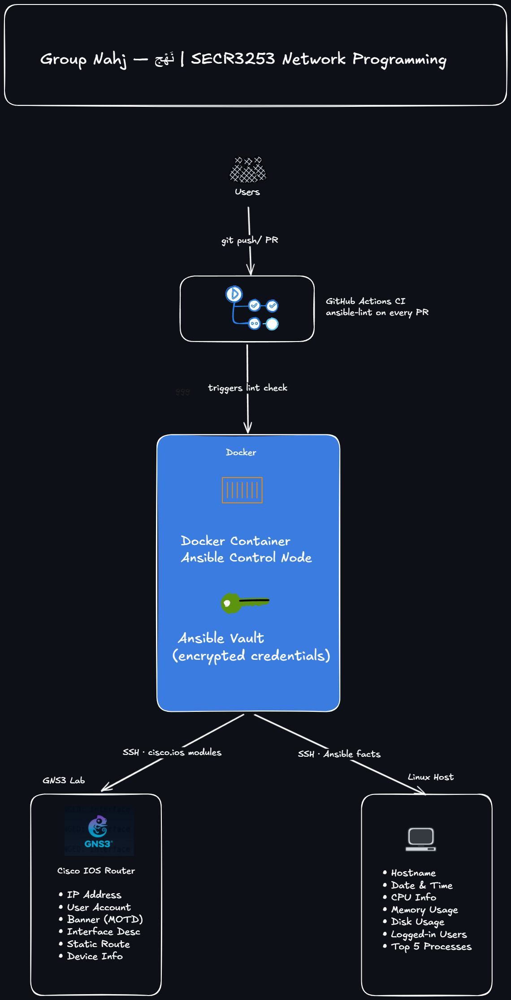

<div align="center">



[](https://github.com/Mhdomer/nahj-net-automation/actions)


</div>

---

## What This Project Does

We are automating two things:

1. **Network Device Configuration** — Ansible pushes configuration tasks to a Cisco IOS router running in GNS3
2. **Linux System Info Collection** — Ansible gathers system details from a Linux host and generates a formatted Markdown report

Credentials are encrypted with **Ansible Vault** — no plain-text passwords anywhere in this repo. A **GitHub Actions CI pipeline** runs `ansible-lint` on every Pull Request before it merges.

---

## Architecture

<div align="center">



</div>

---

## Team

| Member | Role | Branch |
|--------|------|--------|
| Omar *(Leader)* | Docker, repo setup, Ansible Vault, CI pipeline | `feature/setup` |
| Moqbel | Network config — IP, user account, banner | `feature/net-identity` |
| Ali | Network config — interface description, static route, device info | `feature/net-routing` |
| Knan | Linux sysinfo — hostname, date/time, CPU, memory, disk | `feature/linux-facts` |
| Ahmed | Linux sysinfo — logged-in users, top 5 processes, Jinja2 report | `feature/linux-activity` |

---

## What Gets Automated

### Part 1 — Cisco IOS Router (GNS3)

| Task | Playbook |
|------|----------|
| Configure IP address on interface | `playbooks/net_identity.yml` |
| Create local user account | `playbooks/net_identity.yml` |
| Set login banner (MOTD) | `playbooks/net_identity.yml` |
| Add interface description | `playbooks/net_routing.yml` |
| Add static route | `playbooks/net_routing.yml` |
| Retrieve device information | `playbooks/net_routing.yml` |

### Part 2 — Linux Host

| Info Collected | Playbook |
|---------------|----------|
| Hostname | `playbooks/linux_facts.yml` |
| Current date and time | `playbooks/linux_facts.yml` |
| CPU information | `playbooks/linux_facts.yml` |
| Memory usage | `playbooks/linux_facts.yml` |
| Disk usage | `playbooks/linux_facts.yml` |
| Logged-in users | `playbooks/linux_activity.yml` |
| Top 5 processes by CPU | `playbooks/linux_activity.yml` |

> Output is saved as a formatted `report.md` via a Jinja2 template.

---

## Prerequisites

- [Git](https://git-scm.com/downloads)
- [Docker Desktop](https://www.docker.com/products/docker-desktop/) — enable WSL2 on Windows
- [GNS3](https://www.gns3.com/software/download) with a Cisco IOS image loaded

> Ansible runs inside the Docker container — no local install needed.

---

## Project Structure

```
nahj-net-automation/
├── .github/
│   └── workflows/
│       └── ci.yml               # ansible-lint on every PR
├── doc/
│   ├── assets/
│   │   ├── banner.jpg
│   │   └── archet.png
│   ├── overview.md
│   └── phases.md
├── docker/
│   └── Dockerfile               # Ansible control node
├── inventory/
│   └── hosts.yml                # target hosts (no plain-text passwords)
├── vars/
│   └── vault.yml                # Ansible Vault encrypted credentials
├── templates/
│   └── report.j2                # Jinja2 template for sysinfo report
├── playbooks/
│   ├── site.yml                 # master playbook — runs everything
│   ├── net_identity.yml         # IP, user, banner
│   ├── net_routing.yml          # interface desc, static route, device info
│   ├── linux_facts.yml          # hostname, date/time, CPU, memory, disk
│   └── linux_activity.yml       # logged-in users, top 5 processes + report
├── reflections/                 # personal reflection reports
└── README.md
```

---

## Getting Started

### 1. Clone the repo

```bash
git clone https://github.com/Mhdomer/nahj-net-automation.git
cd nahj-net-automation
```

### 2. Create your branch

```bash
git checkout -b feature/<your-name>
```

### 3. Build and enter the Docker control node

```bash
docker compose up -d
docker compose exec ansible bash
```

### 4. Set up the Ansible Vault password

The vault password is shared privately within the group — not stored in the repo.

```bash
echo "your-vault-password" > .vault_pass
```

### 5. Run the full automation

```bash
ansible-playbook playbooks/site.yml --vault-password-file .vault_pass
```

Or run a specific playbook:

```bash
ansible-playbook playbooks/net_identity.yml --vault-password-file .vault_pass
ansible-playbook playbooks/linux_facts.yml --vault-password-file .vault_pass
```

---

## Git Workflow

```
main  (protected — no direct pushes)
 ├── feature/setup             ← Omar
 ├── feature/net-identity      ← Moqbel
 ├── feature/net-routing       ← Ali
 ├── feature/linux-facts       ← Knan
 └── feature/linux-activity    ← Ahmed
```

1. Work on your own branch
2. Commit regularly — at least 3 commits across different days
3. Open a Pull Request to `main`
4. Omar reviews and merges

---

## CI Pipeline

Every Pull Request triggers a GitHub Actions workflow that runs `ansible-lint` on all playbooks. Fix any lint warnings before requesting a review.

---

## Course Info

**Course:** SECR3253 Network Programming  
**Semester:** 2025/2026-2  
**Deadline:** 6 July 2026, 9:00 AM